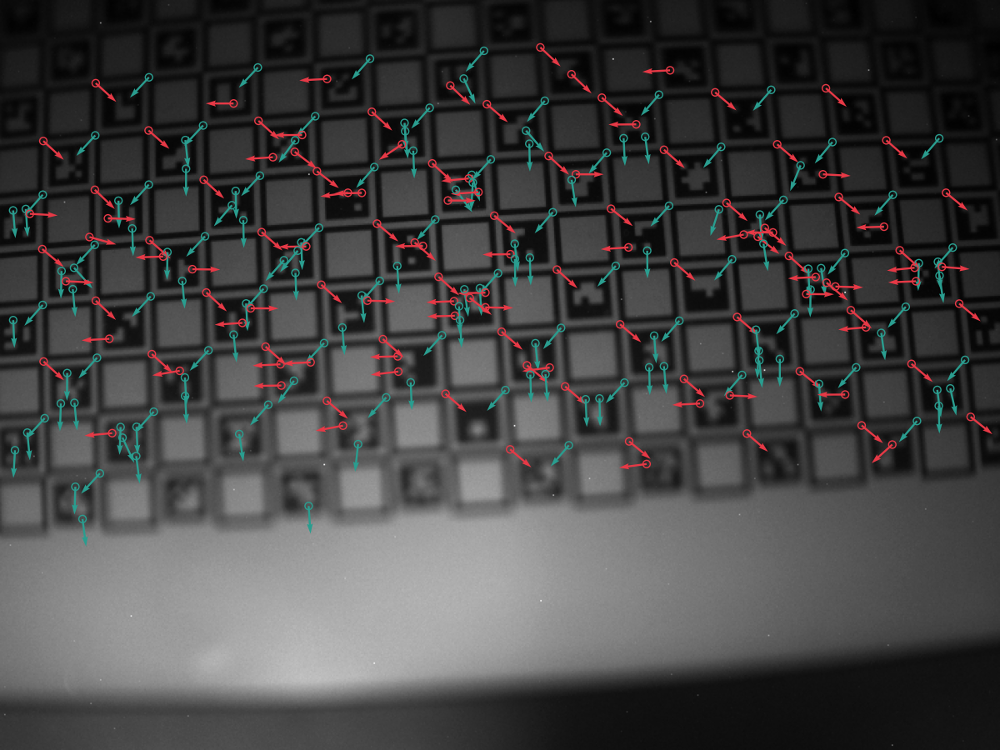
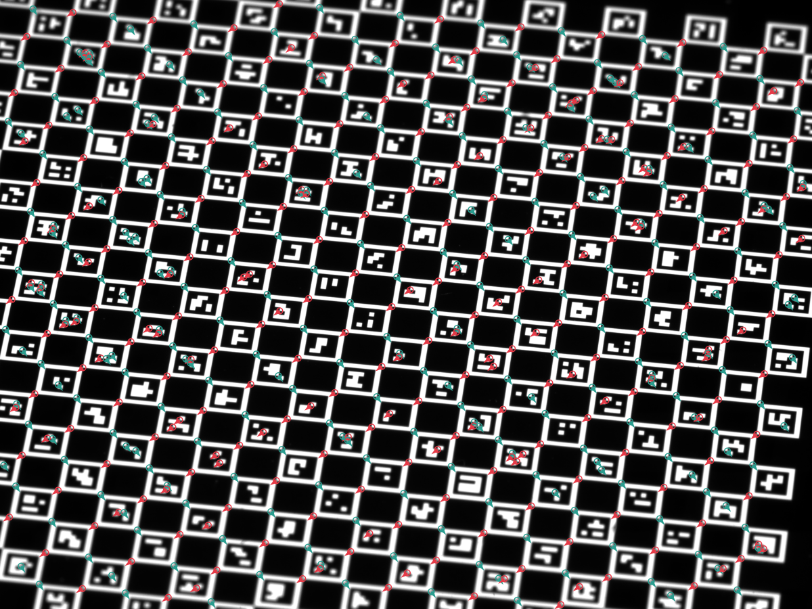

# Part II: Using the Detector

In Part I we oriented ourselves in the project and saw the high‑level
building blocks: the ChESS response, the detector pipeline, and the
`chess-corners` facade crate. In this part we focus entirely on
*using* the detector in practice.

We start with the simplest way to get corners out of an image using
the `image` crate, then show how to work directly with raw grayscale
buffers, and finally look at the bundled CLI for quick experiments and
batch processing.

---

## 2.1 Single-scale detection with `image`

The easiest way to use ChESS is through the `chess-corners` facade
crate, together with the `image` crate’s `GrayImage` type.

Make sure your `Cargo.toml` has:

```toml
[dependencies]
chess-corners = "0.3.1"
image = "0.25"
```

The `image` feature on `chess-corners` is enabled by default, so you
get convenient helpers on `image::GrayImage` without any extra work.

### 2.1.1 Minimal example

Here is a complete single‑scale example:

```rust
use chess_corners::{ChessConfig, ChessParams, find_chess_corners_image};
use image::io::Reader as ImageReader;

fn main() -> Result<(), Box<dyn std::error::Error>> {
    // 1. Load a grayscale image.
    let img = ImageReader::open("board.png")?
        .decode()?
        .to_luma8();

    // 2. Start from a single-scale configuration.
    let cfg = ChessConfig::single_scale();

    // 3. Run the detector.
    let corners = find_chess_corners_image(&img, &cfg);
    println!("found {} corners", corners.len());

    Ok(())
}
```

The key pieces are:

- `ChessConfig::single_scale()` – configures a single‑scale detector
  by setting `multiscale.pyramid.num_levels = 1`.
- `ChessParams::default()` – provides reasonable defaults for the
  ChESS response and detector (ring radius, thresholds, NMS radius,
  minimum cluster size).
- `find_chess_corners_image` – runs the detector on a `GrayImage` and
  returns a `Vec<CornerDescriptor>`.

### 2.1.2 Inspecting detected corners

Each corner is described by a `CornerDescriptor` re‑exported from the
core crate. You can inspect the fields like this:

```rust
for c in &corners {
    println!(
        "corner at ({:.2}, {:.2}), response {:.1}, theta {:.2} rad",
        c.x, c.y, c.response, c.orientation,
    );
}
```

Important details:

- `x`, `y` – subpixel coordinates in full‑resolution *image pixels*,
  using the usual `(0,0)` top‑left origin and `x` to the right,
  `y` down.
- `response` – the ChESS response at this location. Larger positive
  values mean the local structure looks more like an ideal chessboard
  corner.
- `orientation` – orientation of one of the grid axes in radians,
  in `[0, π)`. The other axis is at `orientation + π/2`.

For basic camera calibration workflows you can often treat `response`
as a confidence score and use `orientation` mainly for grid fitting
or downstream topology checks.

### 2.1.3 Tweaking `ChessParams`

The default `ChessParams` values are tuned to work well on typical
calibration images, but it is useful to know what they do:

- `use_radius10` – switch from the canonical r=5 ring to a larger
  r=10 ring, which is more robust under heavy blur or when the board
  covers fewer pixels.
- `threshold_rel` / `threshold_abs` – control how strong a response
  must be to be considered a candidate corner. If `threshold_abs` is
  `Some`, it takes precedence over `threshold_rel`; otherwise a
  relative threshold (fraction of the maximum response) is used.
- `nms_radius` – radius of the non‑maximum suppression window in
  pixels. Larger values give sparser corners.
- `min_cluster_size` – minimum number of positive‑response neighbors
  in the NMS window required to accept a corner, which suppresses
  isolated noise.

Small `threshold_rel` and `nms_radius` values tend to produce more
corners (including weaker or spurious ones), while larger values
produce fewer, stronger corners. It’s often helpful to log or plot the
detected corners on your own images and adjust these parameters once
per dataset.

---

## 2.2 Raw buffer API

The `image` integration is convenient, but you may already have image
data in another form (camera SDK, FFI, GPU pipeline). In those cases
you can bypass `image` entirely and work directly with `&[u8]`
buffers.

### 2.2.1 `find_chess_corners_u8`

The `chess-corners` crate exposes:

```rust
pub fn find_chess_corners_u8(
    img: &[u8],
    width: u32,
    height: u32,
    cfg: &ChessConfig,
) -> Vec<CornerDescriptor>;
```

Requirements:

- `img` must be a **contiguous** `width * height` slice in row‑major
  order.
- Pixels are 8‑bit grayscale (`0` = black, `255` = white).

Usage is nearly identical to the `image`‑based helper:

```rust
use chess_corners::{ChessConfig, ChessParams, find_chess_corners_u8};

fn detect(img: &[u8], width: u32, height: u32) {
    let mut cfg = ChessConfig::single_scale();
    cfg.params = ChessParams::default();

    let corners = find_chess_corners_u8(img, width, height, &cfg);
    println!("found {} corners", corners.len());
}
```

Internally, this constructs an `ImageView` over the buffer and calls
the same multiscale machinery as the `image` helper, so results are
identical for the same configuration.

### 2.2.2 Custom buffers and strides

If your buffers are not tightly packed (e.g., you have a stride or
interleaved RGB data), you will need to adapt them before calling the
detector:

- For RGB/RGBA images, convert to grayscale first (e.g., using your
  own kernel or via `image` when convenient), then call
  `find_chess_corners_u8` on the luminance buffer.
- For images with a stride, either:
  - copy each row into a temporary tightly‑packed buffer and reuse it
    per frame, or
  - construct your own `ResponseMap` using `chess-corners-core` and a
    custom sampling function that respects the stride (covered in
    later parts of the book).

The simplest path is usually:

1. Convert to a packed grayscale buffer once.
2. Reuse it across calls to `find_chess_corners_u8`.

### 2.2.3 ML refiner (feature `ml-refiner`)

The ML refiner is an optional ONNX-backed subpixel refinement stage.
Enable it by turning on the `ml-refiner` feature and calling the ML
entry points:

```rust
use chess_corners::{ChessConfig, find_chess_corners_image_with_ml};
use image::GrayImage;

let img = GrayImage::new(1, 1);
let cfg = ChessConfig::default();
let corners = find_chess_corners_image_with_ml(&img, &cfg);
```

The ML refiner runs an ONNX model on normalized patches (uint8 / 255.0) and
predicts `[dx, dy, conf_logit]`. The current version ignores the confidence
output and applies the offsets directly, using the embedded model defaults.

---

## 2.3 CLI workflows

The workspace includes a `chess-corners` binary that wraps the library
APIs with configuration, image I/O, and basic visualization. It lives
under `crates/chess-corners/bin` and is built when the `cli` feature
is enabled in this crate.

### 2.3.1 Basic usage

From the workspace root, you can run:

```bash
cargo run -p chess-corners --release --bin chess-corners -- \
  run config/chess_cli_config_example.json
```

This will:

- Load the image specified in the `image` field of the config.
- Decide between single‑scale and multiscale based on
  `pyramid_levels` (if `> 1`, multiscale is used).
- Run the detector with the configured parameters.
- Write a JSON file with detected corners and, by default, a PNG
  overlay image with small white squares drawn at corner positions.

The exact fields are defined by `DetectionConfig` in
`crates/chess-corners/bin/commands.rs`. The example config under
`config/` documents common settings:

- `pyramid_levels`, `min_size`, `refinement_radius`, `merge_radius` –
  multiscale controls (mapped onto `CoarseToFineParams`; with
  `pyramid_levels <= 1` the detector behaves as single‑scale, and
  larger values request a coarse‑to‑fine multiscale run, bounded by
  `min_size`).
- `threshold_rel`, `threshold_abs`, `refiner`, `radius10`,
  `descriptor_radius10`, `nms_radius`, `min_cluster_size` – detector
  tuning (mapped onto `ChessParams`; `refiner` accepts
  `center_of_mass`, `forstner`, or `saddle_point` and uses default
  settings for each choice).
- `ml` – set `true` to enable the ML refiner pipeline (requires the
  `ml-refiner` feature).
- `output_json`, `output_png` – output paths; when omitted, defaults
  are derived from the image filename.

You can override many of these fields with CLI flags; the CLI uses
`DetectionConfig` as a base and then applies overrides.

### 2.3.2 ML refiner from the CLI

The CLI switches to the ML pipeline when `ml` is `true` in
the JSON config. You must also build the binary with the
`ml-refiner` feature:

```bash
cargo run -p chess-corners --release --features ml-refiner --bin chess-corners -- \
  run config/chess_cli_config_example_ml.json
```

The ML configuration is currently a boolean toggle; the refiner uses
the embedded model defaults and ignores the confidence output.

### 2.3.3 Inspecting results

The CLI produces:

- A JSON file containing:
  - basic metadata (image path, width, height),
  - the multiscale configuration actually used (`pyramid_levels`,
    `min_size`, `refinement_radius`, `merge_radius`), and
  - an array of corners with `x`, `y`, `response`, and `orientation`.
- A PNG image with the detected corners drawn as small white squares
  over the original image.

You can:

- Load the JSON in Python, Rust, or any other language and feed the
  detected corners into your calibration / pose estimation tools.
- Use the PNG overlay for quick visual validation of parameter
  choices.

Combined with the configuration file, this makes it easy to iterate on
detector settings without recompiling your code. Once you are happy
with a configuration, you can port the settings into your own Rust
code using `ChessConfig`, `ChessParams`, and `CoarseToFineParams`.

### 2.3.4 Example overlays

Running the CLI on the sample images in `testdata/` produces overlays like these:






---

## 2.4 Python bindings

The workspace ships a PyO3-based Python extension in
`crates/chess-corners-py`, published as the `chess_corners` package.
It exposes the same detector with a NumPy-friendly API.

Install (from PyPI):

```bash
python -m pip install chess-corners
```

Basic usage:

```python
import numpy as np
import chess_corners

img = np.zeros((128, 128), dtype=np.uint8)
corners = chess_corners.find_chess_corners(img)
print(corners.shape, corners.dtype)  # (N, 4), float32
```

`find_chess_corners` expects a 2D `uint8` array `(H, W)` and returns a
float32 array with columns `[x, y, response, orientation]`. For
configuration, create `ChessConfig()` and set fields such as
`threshold_rel`, `nms_radius`, `pyramid_num_levels`, and
`merge_radius`. See `crates/chess-corners-py/README.md` for a full
parameter reference.

If the bindings are built with the `ml-refiner` feature, you can call
`find_chess_corners_with_ml` in Python as well. The ML path uses the
embedded model defaults and is slower but can improve subpixel
precision on synthetic data.

---

In this part we focused on the public faces of the detector: the
`image` helper, the raw buffer API, the CLI, and the Python bindings.
In the next parts we will look under the hood at how the ChESS
response is computed, how the detector turns responses into subpixel
corners, and how the multiscale pipeline is structured.
