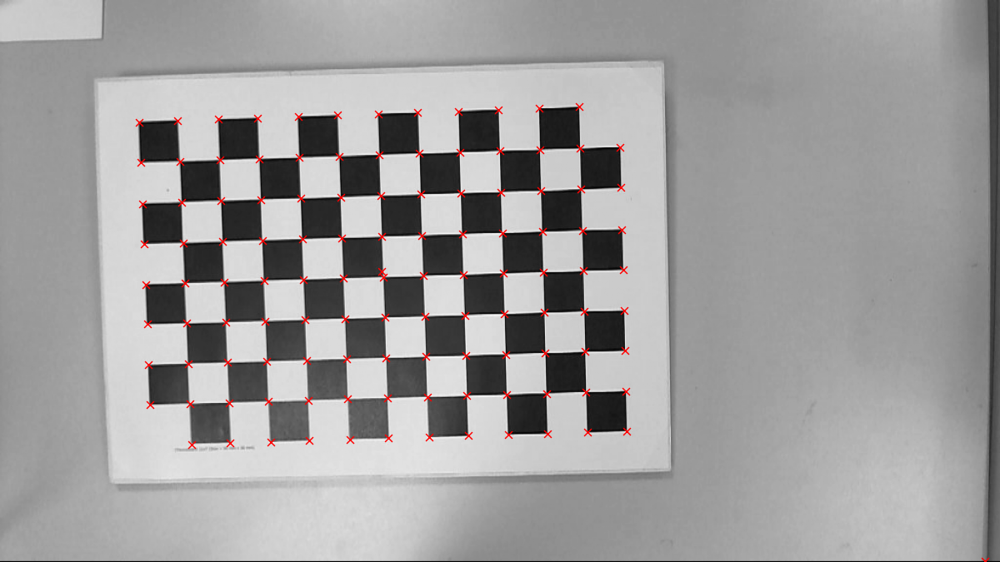
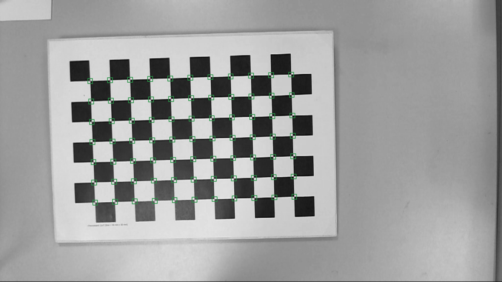

# Part V: Performance
This part summarizes where the ChESS detector stands today on accuracy and speed (measured on a MacBook Pro M4), how to interpret the traces we emit, and how to integrate the detector into larger pipelines.

We took three test images as use cases:

1. A clear 1200x900 image of a chessboard calibration target:

2. A 720x540 image of a ChArUco target with not perfect focus:

3. A 2048x1536 image of another ChArUco calibration target:

We traced the ChESS detector for each of these images, and the results are discussed in this part. The first image was also used to compare with OpenCV Harris features and the `findChessboardCornersSB` function.

## 5.1 Performance

The tests are performed on MacBook Pro M4. The numbers may be very different on your hardware

| small | mid | large
1 level, none | 3.01 | 4.46 | 26.0
1 level, simd | 1.29 | 1.74 | 10.0
1 level, rayon | 1.14 | 1.41 | 6.63
1 level, rayon, simd | 0.92 | 1.15 | 5.34
------
3 levels, none | 0.63 | 0.70 | 4.87
3 levels, simd | 0.40 | 0.42 | 2.77
3 levels, rayon | 0.48 | 0.52 | 1.94
3 levels, rayon, simd | 0.49 | 0.54 | 1.59

Highlights from the timing profiles on small/mid/large images (3-level pyramid vs single-scale):

- **Multiscale** is the clear winner for speed and robustness.
  - Large image: best total ≈ **1.51 ms** with `simd+rayon` (vs 4.86 ms no features, 1.88 ms `rayon` only).
  - Mid: best total ≈ **0.41 ms** with `simd` alone (rayon adds overhead on this size).
  - Small: best total ≈ **0.40 ms** with `simd`.
  - Breakdown: refine dominates (0.1–3 ms depending on seeds); coarse_detect sits around 0.08–0.75 ms; merge is negligible.
- **Single-scale** is slower across the board:
  - Large: ~24.6 ms, mid: ~4.5 ms, small: ~2.9 ms. Use only when you truly need one level.
- **Feature guidance**:
  - Enable **simd** by default; it’s the dominant win on all sizes.
  - Add **rayon** for large inputs (wins on the largest image, minor cost on small/mid).
  - **par_pyramid** was neutral-to-negative in these runs; keep it off unless profiling shows a gain on your workload.
  - Trace fields include `total_ms`, `coarse_detect_ms`, `refine_ms`, `merge_ms`, `single_scale_ms`, and seed counts (`refine_seeds`) for the multiscale path.

## 5.1 Comparison with Harrison detector

The OpenCV Harris feature detector gives the following result:

Here is the result of the OpenCV `findChessboardCornersSB` function:

Harris pixel-level feature detection took 3.9 ms. The final result is obtained by using the `cornerSubPix` and manual merge of duplicates. Chessboard detection took about 115 ms. The ChESS detector is much faster as you can see from the table above. Also, it provides corner orientation that can be handy for a grid reconstruction.

Below we compare the ChESS corners location with the two classical references.

- Overall pixel error (nearest GT per detection): mean 0.24 px, median 0.22 px, 95th percentile 0.50 px, max 0.84 px across both cameras. Left/right are nearly symmetric (mean 0.23–0.25 px).
- Per-frame consistency: most frames land in the 0.17–0.26 px mean range; histograms (`error_hist_overall.png`) show a tight unimodal distribution with a short tail.
- What to look for in the plots:
  - **Histograms** (`error_hist_left/right/overall.png`) reveal the spread and any skew.
  - **Scatters** (`error_scatter_*.png`) highlight outlier detections; a few sparse points near 0.8 px are the worst cases.
- Practical takeaway: at sub-pixel accuracy with <1 px max error, the detector is well within calibration tolerances for typical chessboard-based workflows.

## 5.3 Tracing and diagnostics

- Build with the `tracing` feature (the perf script does this) to emit INFO-level JSON spans.
- Key spans now covered in both paths:
  - `find_chess_corners` (total)
  - `single_scale` (single-path body)
  - `coarse_detect` (coarse response + detection)
  - `refine` (per-seed refinement, includes `seeds` count)
  - `merge` (duplicate suppression)
  - `build_pyramid` (pyramid construction)
- Parsing: `tools/trace/parser.py` extracts the spans above; `perf_report.json` is produced by `tools/perf_bench.py`, and accuracy overlays/timings come from `tools/accuracy_bench.py`.
- Use `--json-trace` on the CLI (or run via `perf_bench.py`) to capture traces; visualize or aggregate with your preferred JSON tools.

## 5.4 Integration patterns

- **Real-time loops**: reuse `PyramidBuffers` via `find_chess_corners_buff`; prefer multiscale + simd, add rayon for larger frames. Keep `merge_radius` modest (2–3 px) to avoid duplicate corners without throwing away tight clusters.
- **Calibration/pose**: the accuracy report shows sub-pixel consistency; feed detected corners directly into calibration routines. Use the accuracy histograms to validate new camera data.
- **Diagnostics in the field**: capture a short trace with `--json-trace` and inspect `refine_seeds` and span timings; spikes usually indicate harder scenes (more seeds) or contention (misconfigured features).
- **Reproducibility**: keep generated reports under `testdata/out/`; rerun `accuracy_bench.py --batch` and `perf_bench.py` after algorithm or config changes, and drop updated plots into docs for before/after comparisons.
