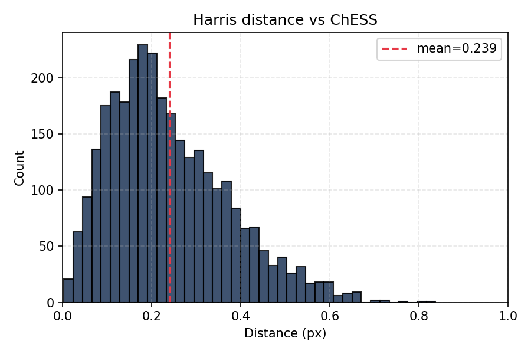
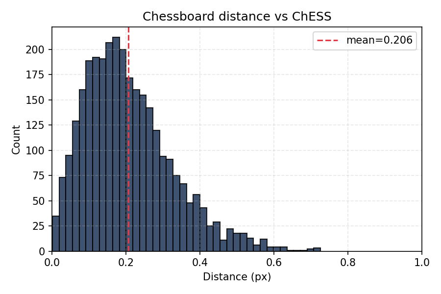
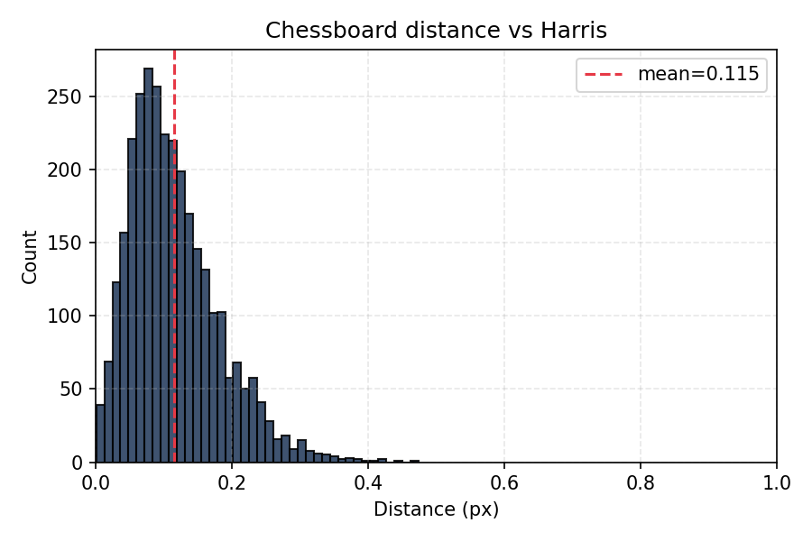
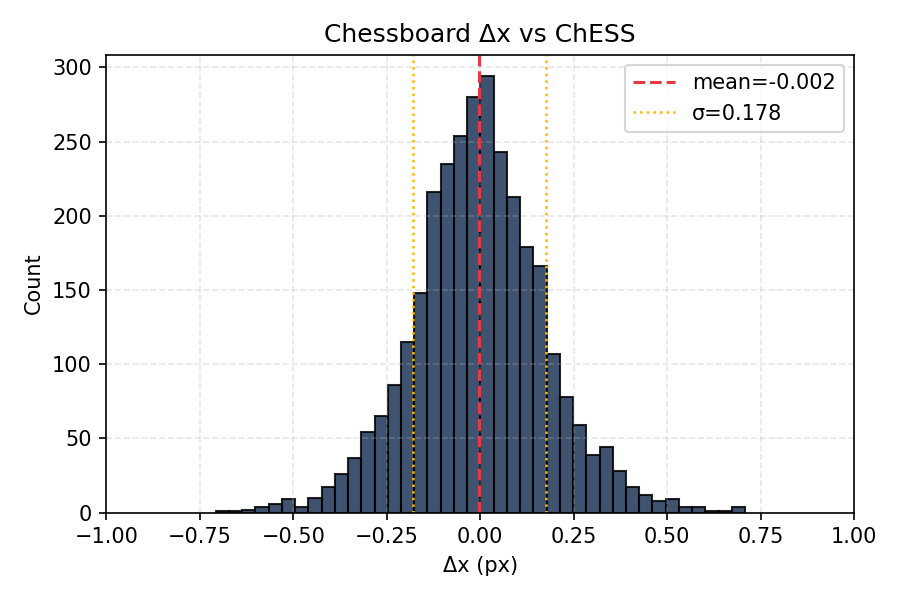
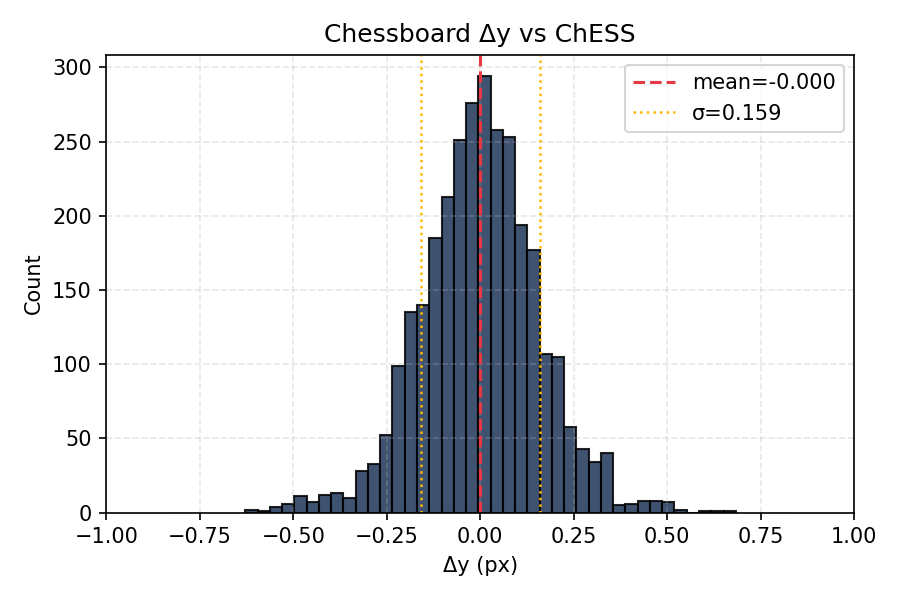

# Part V: Performance, Accuracy, and Integration
This part summarizes where the ChESS detector stands today on accuracy and speed (measured on a MacBook Pro M4), how well it matches classic OpenCV detectors on a stereo calibration dataset, how to interpret the traces we emit, and how to integrate the detector into larger pipelines.

We took three test images as use cases:

1. A clear 1200x900 image of a chessboard calibration target:

2. A 720x540 image of a ChArUco target with not perfect focus:

3. A 2048x1536 image of another ChArUco calibration target:

We traced the ChESS detector for each of these images, and the results are discussed in this part. The first image was also used to compare with OpenCV Harris features and the `findChessboardCornersSB` function. For accuracy, we additionally evaluated the detector on a 2×20‑frame stereo dataset (77 corners per frame).

## 5.1 Performance

The tests below were run on a MacBook Pro M4 (release build). Absolute numbers will vary on your hardware, but the **relative** behavior between configurations is quite stable.

Per‑image timings (ms, averaged over 10 runs; see `book/src/perf.txt` and `testdata/out/perf_report.json` for the full breakdown):

| Config           | Features      | small |  mid | large |
|------------------|--------------|------:|-----:|------:|
| Single‑scale     | none         | 3.01  | 4.46 | 26.02 |
| Single‑scale     | simd         | 1.29  | 1.74 | 10.00 |
| Single‑scale     | rayon        | 1.14  | 1.41 |  6.63 |
| Single‑scale     | simd+rayon   | 0.92  | 1.15 |  5.34 |
| Multiscale (3 l) | none         | 0.63  | 0.70 |  4.87 |
| Multiscale (3 l) | simd         | 0.40  | 0.42 |  2.77 |
| Multiscale (3 l) | rayon        | 0.48  | 0.52 |  1.94 |
| Multiscale (3 l) | simd+rayon   | 0.49  | 0.54 |  1.59 |

Highlights from the timing profiles on small/mid/large images:

- **Multiscale** is the clear winner for speed and robustness.
  - Large image: best total ≈ **1.6 ms** with `simd+rayon` (vs ≈4.9 ms with no features, ≈1.9 ms with `rayon` only).
  - Mid: best total ≈ **0.42 ms** with `simd` alone (rayon adds a bit of overhead at this size).
  - Small: best total ≈ **0.40 ms** with `simd`.
  - Breakdown: refine dominates (0.1–3 ms depending on seeds); coarse_detect sits around 0.08–0.75 ms; merge is negligible.
- **Single-scale** is slower across the board:
  - Large: ≈26 ms, mid: ≈4.5 ms, small: ≈3.0 ms. Use when you need maximal stability and can tollerate some performance drawback.
- **Feature guidance**:
  - Enable **simd** by default; it’s the dominant win on all sizes (although, it requires nightly RUST).
  - Add **rayon** for large inputs (wins on the largest image, minor cost on small/mid).

## 5.2 Accuracy vs OpenCV

The OpenCV `cornerHarris` gives the following result:

Here is the result of the OpenCV `findChessboardCornersSB` function:

Harris pixel-level feature detection took 3.9 ms. The final result is obtained by using the `cornerSubPix` and manual merge of duplicates. Chessboard detection took about 115 ms. The ChESS detector is much faster as is evident from the previous section. Also, it provides corner orientation that can be handy for a grid reconstruction.

Below we compare the ChESS corners location with the two classical references. We took all images from the [Chessboard Pictures for Stereocamera Calibration](https://www.kaggle.com/datasets/danielwe14/stereocamera-chessboard-pictures) public repository as input. Below are distributions of pairwise distances between corresponding features:

- Harris vs ChESS: 0.24 pix
- Chessboard vs ChESS: 0.21 pix
- Harris vs Chessboard: 0.12 pix

It is important that the offsets are not biased:

Mean values are much smaller than standard deviation.

## 5.3 Tracing and diagnostics

- Build with the `tracing` feature (the perf script does this) to emit INFO-level JSON spans.
- Key spans now covered in both paths:
  - `find_chess_corners` (total)
  - `single_scale` (single-path body)
  - `coarse_detect` (coarse response + detection)
  - `refine` (per-seed refinement, includes `seeds` count)
  - `merge` (duplicate suppression)
  - `build_pyramid` (pyramid construction)
- Parsing: `tools/trace/parser.py` extracts the spans above; `perf_report.json` is produced by `tools/perf_bench.py`, and accuracy overlays/timings come from `tools/accuracy_bench.py`.
- Use `--json-trace` on the CLI (or run via `perf_bench.py`) to capture traces; visualize or aggregate with your preferred JSON tools.

## 5.4 Integration patterns

- **Real-time loops**: reuse `PyramidBuffers` via `find_chess_corners_buff`; prefer multiscale + simd, add rayon for larger frames. Keep `merge_radius` modest (2–3 px) to avoid duplicate corners without throwing away tight clusters.
- **Calibration/pose**: the accuracy report shows sub-pixel consistency; feed detected corners directly into calibration routines. Use the accuracy histograms to validate new camera data.
- **Diagnostics in the field**: capture a short trace with `--json-trace` and inspect `refine_seeds` and span timings; spikes usually indicate harder scenes (more seeds) or contention (misconfigured features).
- **Reproducibility**: keep generated reports under `testdata/out/`; rerun `accuracy_bench.py --batch` and `perf_bench.py` after algorithm or config changes, and drop updated plots into docs for before/after comparisons.
